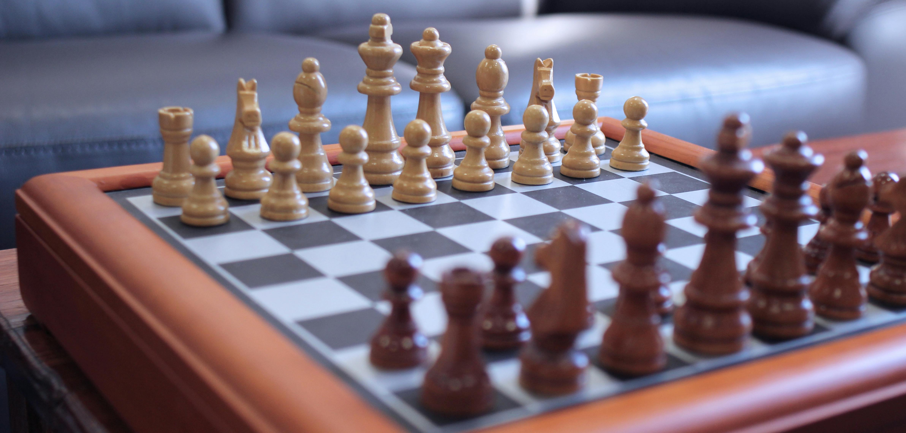

# Creating a chess.com/lichess clone using Go and Vue



Let's create a chess.com/lichess clone MVP using Go and Vue!

<!-- You can find the repo of this project here: [github.com/alvaronaschez/simple-chess](https://github.com/alvaronaschez/simple-chess) -->

## What are we going to build?

A simplified version of [chess.com](https://chess.com) or [lichess.org](https://lichess.org), that works like this:

- You navigate to the website from your browser.
- If there's already one player waiting for a second player to join his game, you join that game.
- Otherwise, you create a new game and wait for a second player to join.


## Goals

It should be as simple as possible while being extensible.

It should be a valid starting point for building something bigger by iterating over it.

## How are we going to build it?

We are going to build a backend using Go, a frontend using Vue and we are going to use WebSockets to communicate between them.


### Why Go?

First of all, I think it makes sense to build this using Go because of its concurrency model and performance.

But there are alternatives like Elixir, Java, Kotlin, Rust... even Python or NodeJS.  
So why Go instead?

Go has become one of my favorite languages because of its simplicity.  
When you start coding in Go you miss a lot of features from other languages, because Go lacks ~~some~~ **a lot of** features by design.  
Soon you realize that's good: It usually doesn't have the things you don't really need.

That's why Go addresses [The Zen Of Python](https://peps.python.org/pep-0020/) way better than Python itself.  
Especially when it comes to the 13th principle: "There should be one-- and preferably only one --obvious way to do it."

The more features a language has, the more [Analysis Paralysis](https://en.wikipedia.org/wiki/Analysis_paralysis) you get.  
Have a look at [The Paradox of Choice](https://en.wikipedia.org/wiki/The_Paradox_of_Choice) if you are not convinced yet.

### Why Vue?

I'm a backend engineer.

I tried with React first, as I feel it is kind of the defacto standard. But I failed: it was too complex for my liking.

Then I tried with [Web Components](https://developer.mozilla.org/en-US/docs/Web/API/Web_components), but it didn't work out as expected either.

Then I found [Chessground](https://github.com/lichess-org/chessground) and its Vue component wrapper [vue3-chessboard](https://github.com/qwerty084/vue3-chessboard).

## Enough talking, let's start coding!

The idea is the following:

- Client 1 creates a WebSocket connection and waits for the game to start.
- Client 2 creates a WebSocket connection and waits for the game to start.
- Once the server has those two clients connected, it emits a "start" event, telling each client which color are they playing.
- Then it is white's turn, so white client makes a move and sends a "move" event to the server. The server forwards that event to the other client. Then black knows it is its turn and which move did white make.
- The previous point repeats until the game ends, interchanging white and black roles.

> [!NOTE]  
> Notice that we are going to create the whole project just by editing 3 files and writing less than 200 lines of code.

### The server part

Create a folder for the project and jump into it

```sh
❯ mkdir simple-chess && cd simple-chess
```

Create a folder for the backend and jump into it

```sh
❯ mkdir backend && cd backend
```

Start your go project (change your GitHub username accordingly)

```sh
❯ go mod init github.com/alvaronaschez/simple-chess
```

Install [Gorilla WebSocket](https://github.com/gorilla/websocket) dependency

```sh
❯ go get github.com/gorilla/websocket
```

Create the `main.go` file

<h5 align="right">backend/main.go</h5>

```go
package main

import (
	"fmt"
	"log"
	"net/http"

	"github.com/gorilla/websocket"
)

var upgrader = websocket.Upgrader{
	ReadBufferSize:  2048,
	WriteBufferSize: 2048,
}

var game *ChessGame

func wsHandler(w http.ResponseWriter, r *http.Request) {
	upgrader.CheckOrigin = func(r *http.Request) bool { return true }
	ws, err := upgrader.Upgrade(w, r, nil)
	if err != nil {
		log.Println(err)
	}

	if game == nil {
		game = NewChessGame(ws)
	} else {
		game.Join(ws)
		game = nil
	}
}

func main() {
	fmt.Println("Listening at port 5555")
	http.HandleFunc("/ws", wsHandler)
	log.Fatal(http.ListenAndServe(":5555", nil))
}
```

Create the `ChessGame` class

<h5 align="right">backend/game.go</h5>

```go
package main

import (
	"errors"

	"github.com/gorilla/websocket"
)

type ChessGame struct {
	whiteWebsocket *websocket.Conn
	blackWebsocket *websocket.Conn
}

type Message struct {
	Type      string `json:"type" validate:"required,oneof=start move error"`
	Color     string `json:"color" validate:"oneof=white black,required_if=Type start"`
	From      string `json:"from" validate:"required_if=Type move"`
	To        string `json:"to" validate:"required_if=Type move"`
	Promotion string `json:"promotion" validate:"oneof=q r b k,required_if=Type move"`
}

func NewChessGame(ws *websocket.Conn) *ChessGame {
	game := ChessGame{whiteWebsocket: ws}
	return &game
}

var ErrCannotJoinStartedGame = errors.New("cannot join a started game")

func (game *ChessGame) Join(ws *websocket.Conn) error {
	// you cannot join the same game twice
	if game.blackWebsocket != nil {
		return ErrCannotJoinStartedGame
	}
	game.blackWebsocket = ws
	whiteChannel := make(chan Message)
	blackChannel := make(chan Message)
	go playChess(game.whiteWebsocket, game.blackWebsocket, whiteChannel, blackChannel)
	go forwardFromWebsocketToChannel(game.whiteWebsocket, whiteChannel)
	go forwardFromWebsocketToChannel(game.blackWebsocket, blackChannel)
	return nil
}

func playChess(
	whiteWebsocket, blackWebsocket *websocket.Conn,
	whiteChannel, blackChannel <-chan Message,
) {
	turnWhite := true
	whiteWebsocket.WriteJSON(Message{Type: "start", Color: "white"})
	blackWebsocket.WriteJSON(Message{Type: "start", Color: "black"})
	for {
		select {
		case message := <-whiteChannel:
			if message.Type == "error" {
				return
			}
			if turnWhite {
				blackWebsocket.WriteJSON(message)
				turnWhite = false
			}
		case message := <-blackChannel:
			if message.Type == "error" {
				return
			}
			if !turnWhite {
				whiteWebsocket.WriteJSON(message)
				turnWhite = true
			}
		}
	}
}

func forwardFromWebsocketToChannel(ws *websocket.Conn, ch chan<- Message) {
	defer ws.Close()
	for {
		message := Message{}
		err := ws.ReadJSON(&message)

		if err != nil {
			ch <- Message{Type: "error"}
			return
		}

		ch <- message
	}
}
```

Run `go mod tidy`

```sh
❯ go mod tidy
```

### The client part

Navigate to the project root folder

```sh
❯ cd ..
```

Create a new Vue project (add TypeScript support if you want to use the code snippet as it is)

```sh
❯ npm create vue@latest

Vue.js - The Progressive JavaScript Framework

✔ Project name: … frontend
✔ Add TypeScript? … No / [Yes]
...
```

Jump into the newly created subproject

```sh
❯ cd frontend
```

Install `vue3-chessboard` component

```sh
❯ npm i vue3-chessboard
```

Edit Vue project entry point `frontend/src/App.vue`

<h5 align="right">frontend/src/App.vue</h5>

```html
<script setup lang="ts">
import { ref } from 'vue'
import { BoardApi, TheChessboard, type MoveEvent } from 'vue3-chessboard'
import 'vue3-chessboard/style.css'

let board: BoardApi
const color = ref()

const socket = new WebSocket('ws://localhost:5555/ws')
socket.addEventListener('message', (event) => {
  const message = JSON.parse(event.data)
  if (message.type === 'start') {
    color.value = message.color
  } else if (message.type === 'move') {
    const { from, to, promotion } = message
    board.move({ from, to, promotion })
  }
})

function handleBoardCreated(boardApi: BoardApi) {
  board = boardApi
}

function handleMove(move: MoveEvent) {
  if (!color.value.startsWith(move.color)) {
    return
  }
  const { from, to, promotion } = move
  const message = JSON.stringify({ from, to, promotion, color: color.value, type: 'move' })
  socket.send(message)
}
</script>

<template>
  <TheChessboard
    v-if="color"
    @move="handleMove"
    @board-created="handleBoardCreated"
    :player-color="color"
    :board-config="{ orientation: color }"
  />
  <h1 v-else>Waiting for player 2</h1>
</template>
```

Run the backend

```sh
❯ (cd backend && go run .)
```

Open another terminal and run the frontend

```sh
❯ (cd frontend && npm run dev)
```

Open two clients in the browser at http://localhost:5173/ and enjoy the game!

Thanks for reading!
